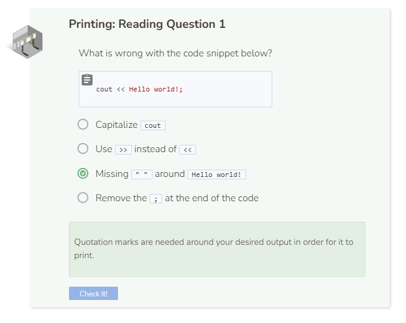

# Printing to the Console

The reason you were able to see the words appear is because of the `cout` command followed by the `<<` and finally what you want to print "Hello world";. `cout` is short for characters out and is used to output your desired text.

