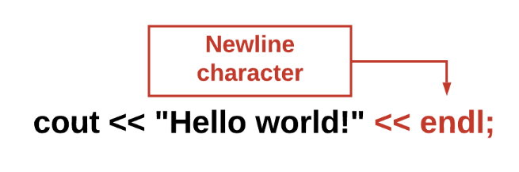
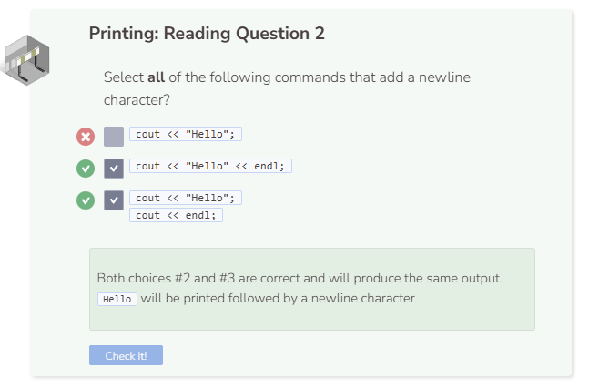

# Printing without the Newline Character

The `cout` command does not add a newline character. The code below will print the two words on the same line without a space.

The text in red shows the `endl` command which adds the newline character. (The newline character is what is inserted when you press “Enter” or “Return”).

