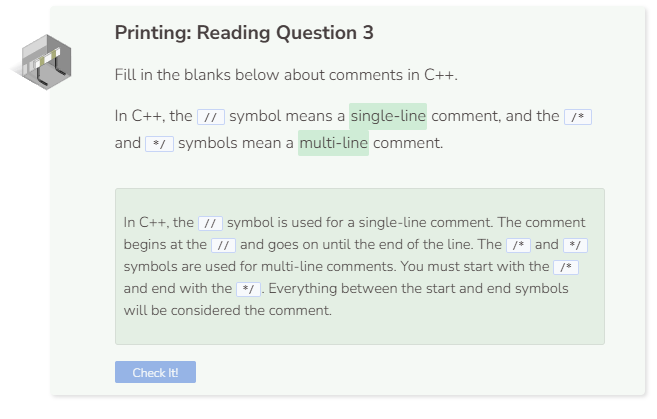

# Comments

In C++, to write notes in code without affecting its function, we can use `//` to make a single-line comment.

Comments can also be used to help you fix your code. You can “comment out” lines of code that are not working or you suspect are causing problems.

To make a block comment you can either make multiple single-line comments using `//` or wrap the set of lines in `/*` and `*/`.

