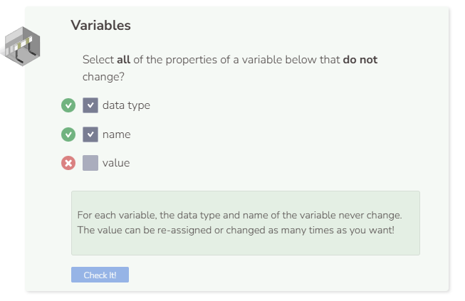

# Variables
## What Is a Variable?
In computer science, we often need to use data. Variables are used to store a value for a particular type of data.

Each variable in C++ has:
1. a data type
2. a name
3. a value

## Three Actions for Variables
There are a few different actions taken involving variables:
1. Declaring - when you set or declare the data type and name of the variable. These two properties of a variable do not change.
2. Assigning - when you set the value of the variable. The value of a variable can change.
3. Accessing - when you retrieve the value of the variable by calling its name.

You must declare and assign a variable before you can access it.

