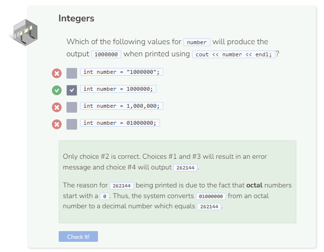

# Data Types: Integers
## Integers
Integers (often called ints) are whole numbers. They can be positive or negative. Do not use a comma when typing large numbers.

The reason for 262144 being printed is due to the fact that octal numbers start with a 0. Thus, the system converts 01000000 from an octal number to a decimal number which equals 262144.