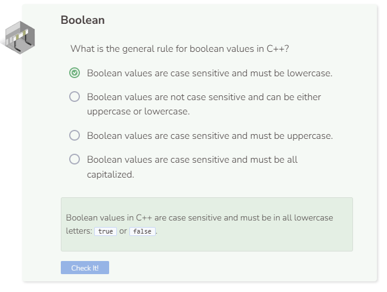

# Data Types: Boolean
## Boolean
A `boolean` variable (declared as a bool) can only take on the value of `true` or `false`.

Printing a `boolean` of `true` resulted in a `1` and a `boolean` of `false` resulted in a `0` when you remove the `boolalpha <<` command. In C++, the boolean value of `true` is associated with the integer `1` while the boolean value of `false` is associated with the integer `0`. Assigning the value of uppercase `True` or `False` to a `boolean` variable will cause an error message to appear.

