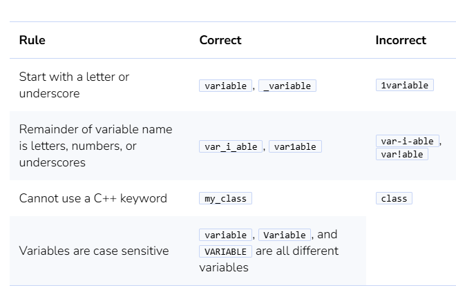
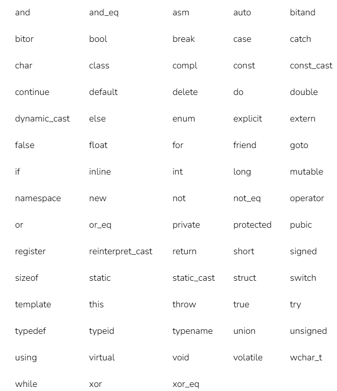
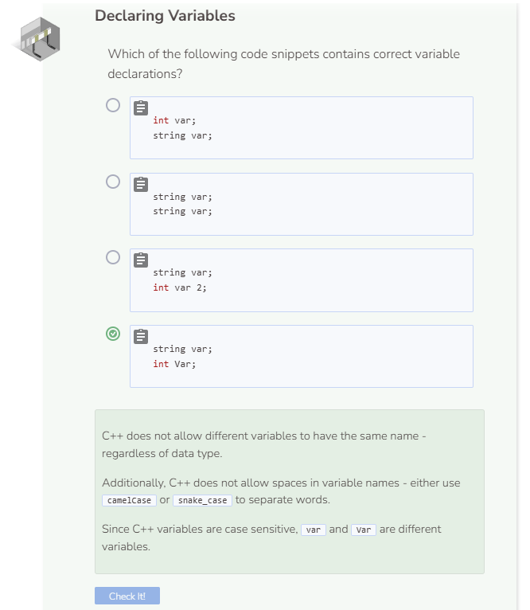

# Declaring Variables
Declaring a variable has two parts - setting or declaring the **data type** and the **name** of the variable. These two properties of a variable do **not** change.

To declare a variable, type the data type and name of the variable you want to create, and a `;` (semi-colon). 

## Variable Naming Rules

## What Are C++ Key Words?
C++ keys words are words that are reserved for specific functions or tasks within C++ programs. These words cannot be used to name variables and will result in errors if they are not handled correctly.

