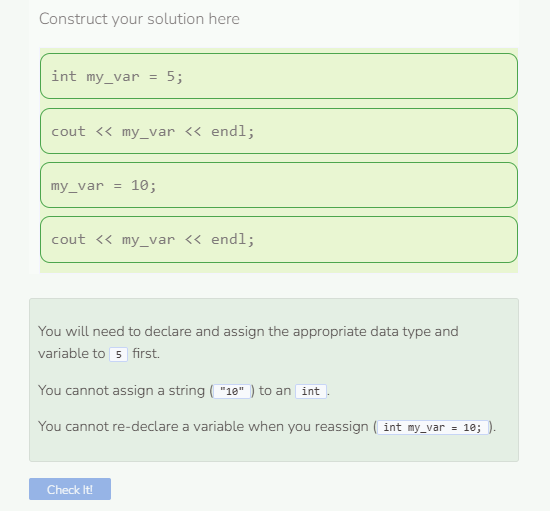

# Initializing, Assigning, and Accessing
## Initializing & Assigning Values
We call the process of setting the `initial` value of a variable `initialization`. Recall that you can do this separately after the declaration or combine it into the same statement as the declaration.

Since the value stored in a variable can change, we call changing the value **assigning** or **re-assigning**. Use the assignment operator, `=`, to give a variable a new value.

## Accessing Variables
When we use a variable’s name to get the value like in the `cout` statements above, we say we are accessing the variable.

