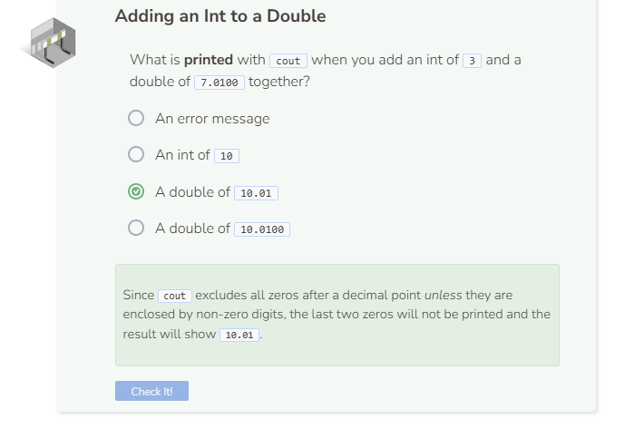

# Addition
## The Addition (+) Operator
The addition operator works as you would expect with numbers.

When you add an int of `3` to a double of `7.1` you get `10.1`. However, when you add an int of `3` to a double of `7.0`, you get `10` instead of `10.0`. This occurs because by default `cout` does not print zeros after a decimal point unless those zeros are enclosed by other non-zero digits.

Examples:
- `cout << 7 + 3.14;` prints `10.14`
- `cout << 7.0 + 3.00;` prints `10`
- `cout << 7.00 + 3.01400;` prints `10.014`

Note that when an `int` and a `double` are added together, the result will be a `double` because the program will take on the data type that is more _flexible_.

