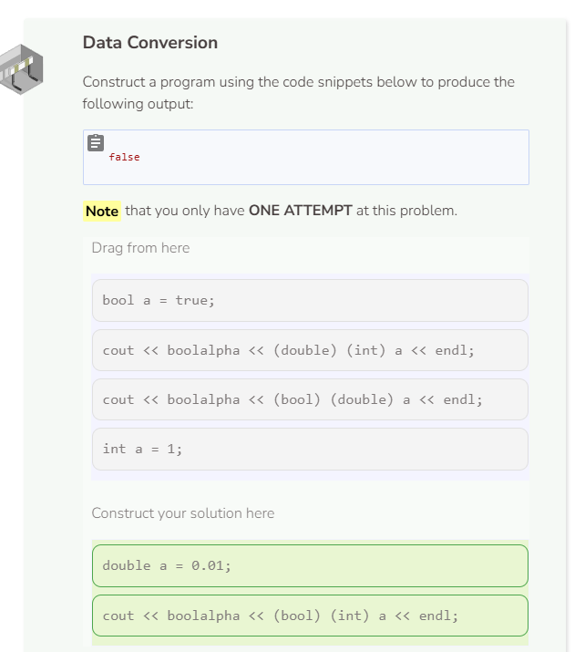
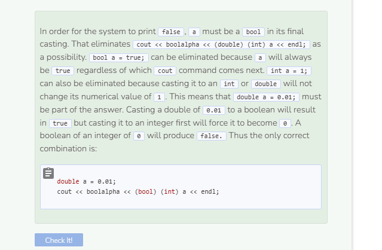

# Type Casting
## Type Casting
Type casting (or type conversion) is when you change the data type of a variable.

```cpp
int numerator = 40;
int denominator = 25;
int number = 0;
cout << boolalpha << (bool) number << endl;
cout << numerator / denominator << endl;
cout << (double) numerator / denominator << endl;
```

`numerator` and `denominator` are integers, but `(double)` converts `numerator` into a `double`. You can use `(double)`, `(int)`, and `(bool)` to cast any `double`, `integer`, or `boolean` between each other. Note that casting an `integer` of `0` or a `double` of `0.0` to a `boolean` will result in `false`. Any other `integer` or `double` values will result in `true`.

```cpp
int numerator = 40;
int denominator = 25;
int number = 5;
cout << boolalpha << (bool) number << endl;
cout << numerator / denominator << endl;
cout << (double) numerator / denominator << endl;
printf("%d \n", numerator / denominator);
printf("%f \n", (double) numerator / denominator);
printf("%f \n", (double) (numerator / denominator));
```
If either or both numbers in C++ division are `double`s, then `double` division will occur. In the last example, `numerator` and `denominator` are both `int`s when the division takes place which results in an `int` of `1`. An `integer` of `1` converted to a `double` is `1.000000` but `cout` removes the decimal point and all of the trailing zeros.

## Data Type Compatibility

```cpp
int a = 5;
string b = "3";
cout << a + b << endl;
```
In C++, you can add a combination of `int`s, `double`s, and `bool`s together. Remember that a `boolean` is either `1` if it’s `true` or `0` if it’s `false`. In the example above, adding a `string` to an `integer` results in an error. That’s because a `string` has no numerical value and can only be added to other `string`s. However, you can convert the string `b` to an integer to fix the problem by using `stoi()`. `stoi()` acts as a function to convert a `string` into an `integer`. The string or string variable goes into the `()` to be converted. See below for a list of type-conversion functions.

```cpp
int a = 5;
string b = "3";
string c = "3.14";
bool d = true;
cout << a + stoi(b) << endl;
```

You can convert the string `"3.14"` to an integer using `stoi()` which will result in an `int` of `3`. To retain the decimal places, use `stod()` instead. In addition, the `to_string()` function will convert a boolean into the string form of its numerical value. `to_string(true)` will convert `true` to `"1"` instead of `1`. This is why adding `b`, which is a string of `"3"`, to `to_string(d)` resulted in the string of `"31"`.

```cpp
int a = 5;
string b = "3";
string c = "3.14";
bool d = true;
cout << b + to_string(d) << endl;
```


