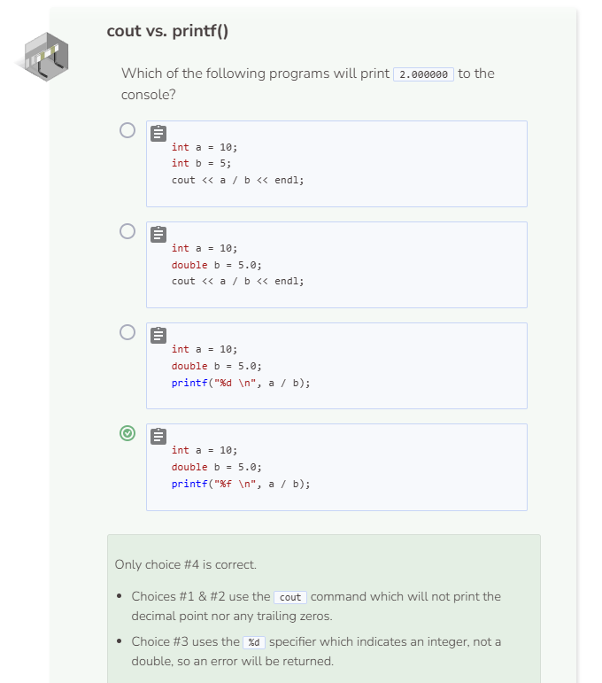

# Printing Floating Point Numbers
## cout
The `cout` command is considered to be non-specific because you can use the same syntax for all of your printing needs (e.g. `cout << 1;`, `cout << "Hello";`, and `cout << true;`). However, for printing certain numbers, it is not always clear if what’s printed is an `int` or a `double` sometimes.

Even though you are printing a `double` of `1.0`, the system will disregard the decimal and the trailing zero when `cout` is used. There is another print command called `printf()` that also prints text to the console.

## printf()
`printf()` originates from the C language and, unlike the `cout` command, it is considered to be specific. This means that you must specify what type of data you want to print before you can use the command successfully.

When `printf()` is used, a specifier is needed in order to tell the system what type of data you want to print. The `%d` tells the system to print an integer and `%f` tells the system to print a floating point number. If you use an incorrect specifier, you will receive an error message. By default, floating point numbers contain six zeros after the decimal point if they are printed using printf().

The `\n` in printf() is equivalent to endl. They both print a newline character. Removing the `\n` from `printf("%d \n", a);` will delete the newline character and cause the variables `a` and `b` to be printed side-by-side.

## cout vs. printf()
Unless you want to be specific with how your data is printed, you should always default to using `cout`. Only use `printf()` when formatting is important.

