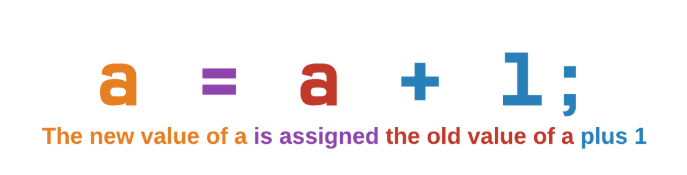
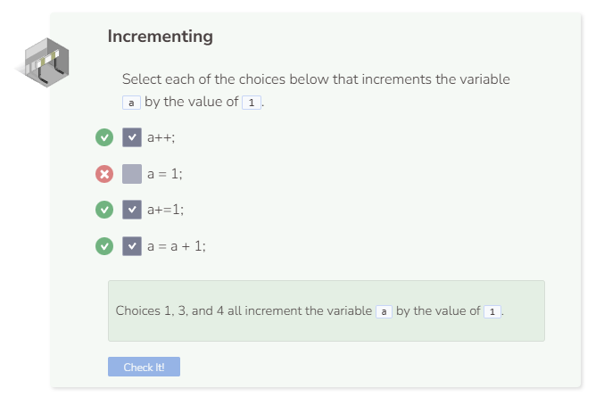

# Incrementing Variables
## Incrementing Variables
Incrementing a variable means to increase the value of a variable by a set amount. The most common incrementation you will see is when a variable increments itself by the value of 1.

## How to Read `a = a + 1`
The variable `a` appears twice on the same line of code. But each instance of `a` refers to something different.

## The `++` and `+=` Operators
Since incrementing is such a common task for programmers, many programming languages have developed a shorthand for `a = a + 1`. The result is a++ which does the same thing as `a = a + 1`.

In the cases where you need to increment by a different number, you can specify it by using the `+=` operator. You can replace `b++;` with `b+=1`; in the code above and still get the same result.

