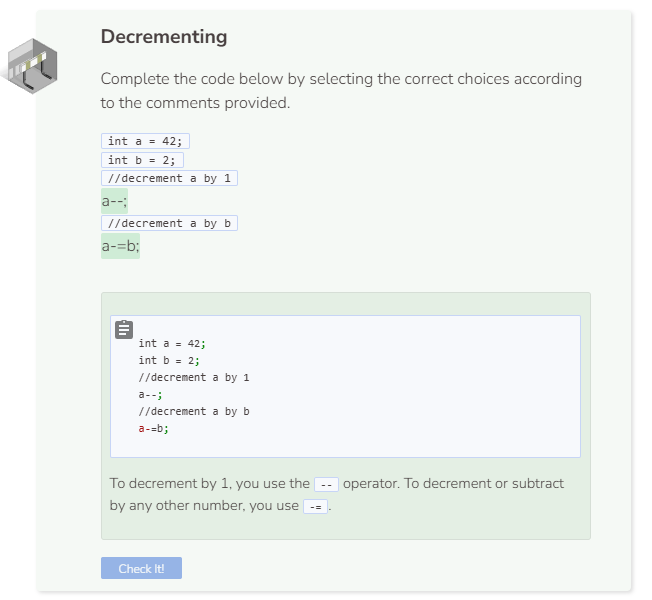

# Subtraction
## Subtraction

Recall that a `bool` of `true` is actually an integer of `1` and `false` is actually `0`. Thus, the system is able to add and subtract `bools` and `ints`. In addition, assigning `b` which is of type `int` to `3.1` will force the variable to adopt the integer value of 3 instead. Remember that all ints disregard decimal places.

## The `--` and `-=` Operators

**Decrementing** is the opposite of incrementing. Just like you can increment with `++`, you can decrement using `--`.

Like `+=`, there is a shorthand for decrementing a variable, `-=`. For example, if you want to decrement the variable `a` by `2` instead of `1`, replace `a--` with `a-=2`.

## Subtraction and Strings
You might be able to concatenate strings with the `+` operator, but you cannot use the `-` operator with them.

