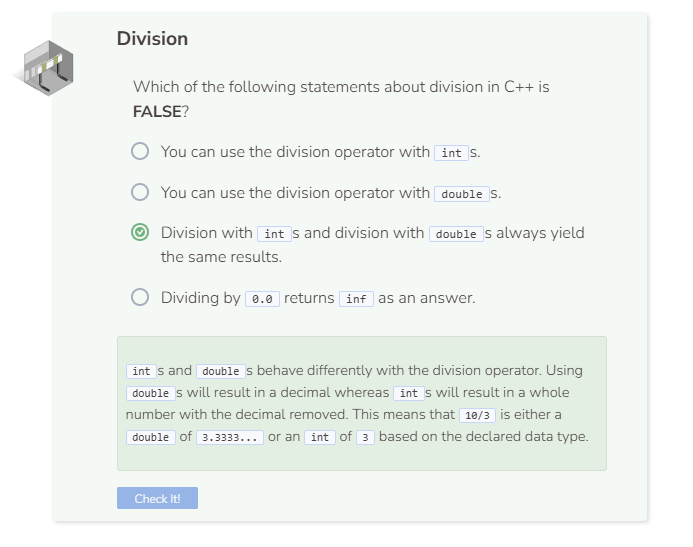

# Division
## Division
Division in C++ is done with the `/` operator.

Division by zero is undefined in mathematics. In C++, dividing by an **integer** of `0` results in an error message. However, dividing by a **double** of `0.0` results in `inf` which is short for infinity.

## Integer Division
Normally, you use `double` in C++ division since the result usually involves decimals. If you use integers, the division operator returns an `int`. This “integer division” does not round up, nor round down. It removes the decimal value from the answer.

