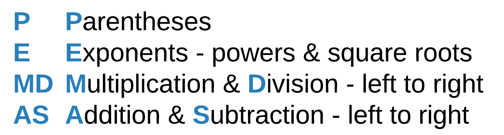
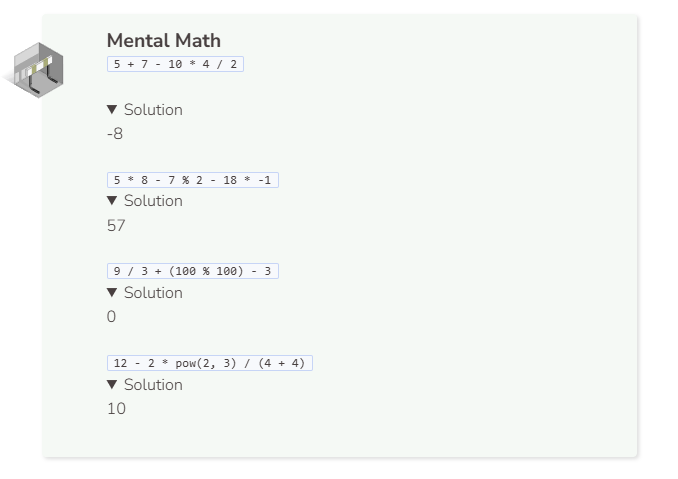
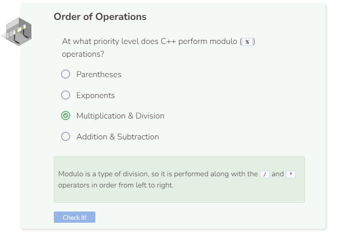

# Order of Operations
## Order of Operations
C++ uses the **PEMDAS** method for determining order of operations.



By default, there are no operators for exponents and square roots. Instead, functions such `pow( , )` and `sqrt()` are used to calculate powers and square roots respectively. In order to use these functions, they must be imported by including `#include <cmath>` at top of the program header. For exponents, the base number goes before the `,` in `pow( , )` and the exponent goes after the `,`. For example, `pow(4, 2)` calculates $4^2$ and `pow(4, 0.5)` calculates $4^{0.5}$ or $4^{1/2}$ . For square roots, the number goes inside the `()` in `sqrt()`. An example is `sqrt(4)` which calculates $\sqrt{2}$

`pow(25, (1 / 2))` results in `1` because integer division is performed within `(1 / 2)`. `1` divided by `2` returns in an integer of `0` and $25^0$ computes to `1`. On the other hand, `pow(25, (1.0 / 2.0))` involves double division which is why `5` was computed.

The code below should output `10.000000`.
```cpp
int a = 2;
int b = 3;
int c = 4;
double result = 3 * a - 2 / (b + 5) + c;
printf("%f \n", result);
```

- The first step is to compute `b + 5` (which is `8`) because it is surrounded by parentheses.
- Next, do the multiplication and division going from left to right: `3 * a` is `6`.
- `2` divided by `8` is `0` (remember, the `/` operator returns an int when you use two `int`s so `0.25` becomes `0`).
- Next, perform addition and subtraction from left to right: `6 - 0` is `6`.
- Finally, add `6` and `4` together to get `10`.
- Since result is of type `double`, `10.000000` is printed.




