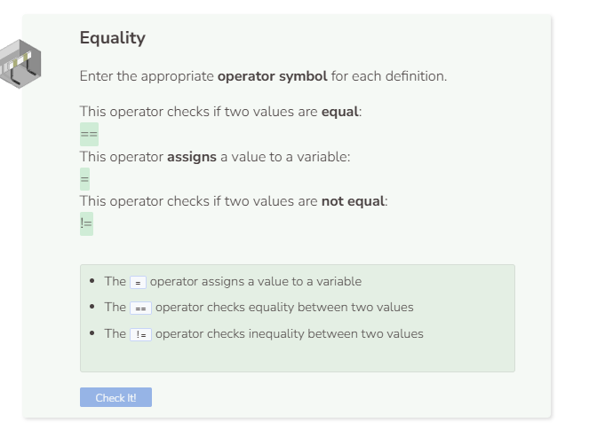

# Equal To & Not Equal To
Boolean operators are operators that return a boolean value (true or false).
## Equal To
C++ uses the `==` operator to determine equality. Beginners often confuse the `=` and the `==` operators. Remember, `=` is the assignment operator.

## Not Equal To
The `!=` operator checks to see if two values are _not equal_.

