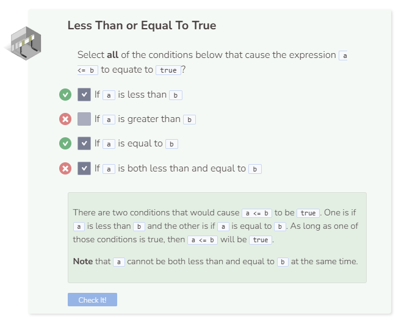

# Less Than & Less Than or Equal To
## Less Than
The `<` operator is used to check if one value is less than another value.

It is possible to declare and assign `int b = false;` because `false` is just a value of `0`. Since `5` is not less than `0`, `false` is returned.

## Less Than or Equal To
The `<=` operator is used to check if one value is less than or equal to another value.

`false` is less than `true` because `0` is less than `1`.

