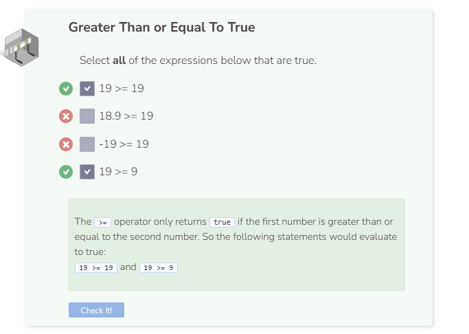

# Greater Than & Greater Than or Equal To
## Greater Than
The `>` operator is used to check if one value is greater than another value.

`9` is both greater than the value of `false`, which is `0`, and the value of `true`, which is `1`.

## Greater Than or Equal To
The `>=` operator is used to check if one value is greater than or equal to another value.

`true` is greater than `false`.

