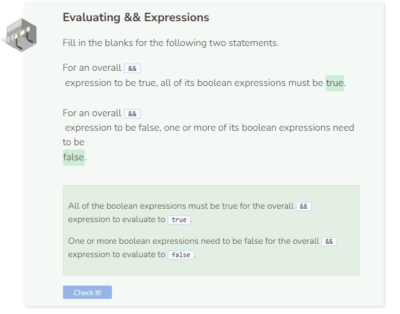

# And
## The `&&` Operator
The `&&` (and) operator allows for compound (more than one) boolean expressions. All boolean expressions must be `true` in order for the whole thing to be `true`. If at least one boolean expressions is `false`, then the whole thing is `false`.

## Multiple `&&` Statements
You can chain several `&&` expressions together. They are evaluated in a left-to-right manner.

```cpp
bool a = true;
  bool b = true;
  bool c = false;
  cout << boolalpha << (a && b && a && b && c) << endl;
```
`c` is the only variable is that is `false`. Thus, if `c` is involved in an `&&` expression, the entire thing will evaluate to `false`. Any combinations of `a`s and/or `b`s will result in `true`.

