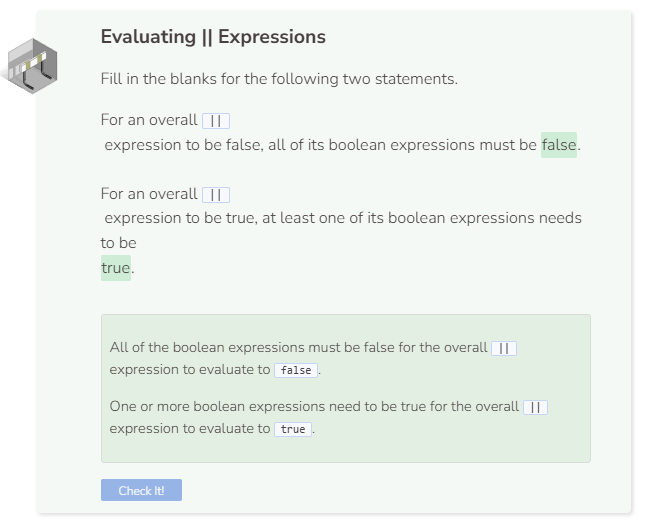

# Or
## The `||` Operator
The `||` (or) operator allows for compound (more than one) boolean expressions. If at least one boolean expression is true, then the whole thing is true. To be false, all boolean expressions must be false.

## Multiple `||` Statements
You can chain several `||` expressions together. They are evaluated in a left-to-right manner.

