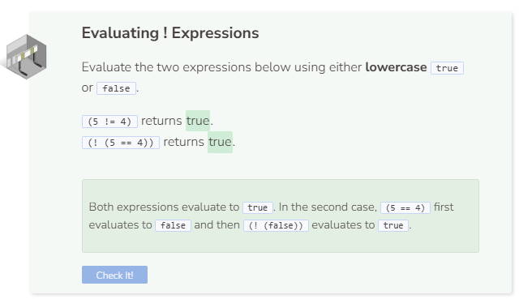

# Not
## The `!` Operator
The `!` (not) operator produces the opposite result of the boolean expression that it modifies.

The `!` operator works similarly to how a `-` (negative) sign works in mathematics. The `-` of a positive number is a negative number and the `-` of a negative number is a positive number.

## Order of Boolean Operators
Much like how arithmetic operators are evaluated in a certain order, boolean operators also work according to their priority level. Boolean operations are evaluated in the following order from highest to lowest priority:
1. Parentheses `()`
2. Not `!`
3. And `&&`
4. Or `||`

