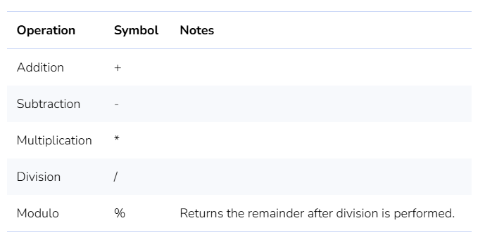
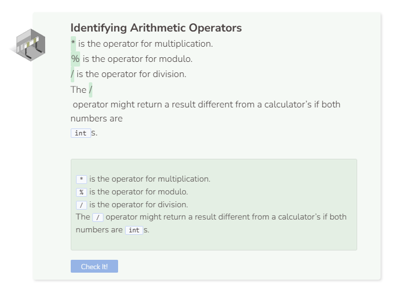

# Lab: Arithmetic Operators
## Tutorial Lab 1: Arithmetic Operators
Arithmetic operations in C++ are mostly the same as what you learned in math class. However, the symbols used in C++ may be different.



```cpp
cout << 10 + 3 << endl;
cout << 10 - 3 << endl;
cout << 10 * 3 << endl;
cout << 10 / 3 << endl;
cout << 10 % 3 << endl;
```

Program results:
1. Addition works as expected.
2. Subtraction works as expected.
3. Multiplication works as expected.
4. Division with integers will return a truncated integer result.
5. Modulo returns 1 because that is the remainder (not the decimal) after division is performed.

