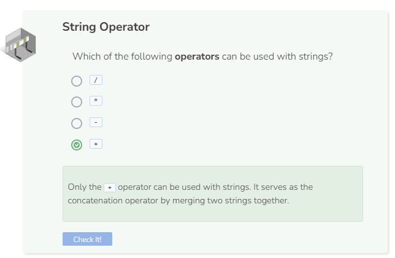

# Lab: Strings
## Tutorial Lab 2: Strings
You can use the `+` operator with strings, even though the result is not based on math. Using the `+` operator with strings is called concatenation.
Use the text editor on the left to enter the following code:

```cpp
string string1 = "hip ";
string string2 = string1 + string1;
string string3 = "hoo";
string string4 = "ray!";
string string5 = string3 + string4;
cout << string2;
cout << string5 << endl;
```
Below are the steps that C++ takes when evaluating the code above.
1. Assign the value `"hip "` to the variable `string1`. Note the inclusion of a space after the word `hip`.
2. The variable `string2` will have the value of `"hip hip "` because `string1 + string1` repeats the value of `string1` two times.
3. Declare `string3` and assign it the value of `"hoo"`.
4. Declare `string4` and assign it the value of `"ray!"`.
5. Declare `string5` and assign it the value of `string3` combined with the value of `string4` (`"hooray!"`).
6. Print the value of `string2` (`"hip hip "`) without the newline character.
7. Print the value of `string5` (`"hooray!"`) to the end of `string2`.

