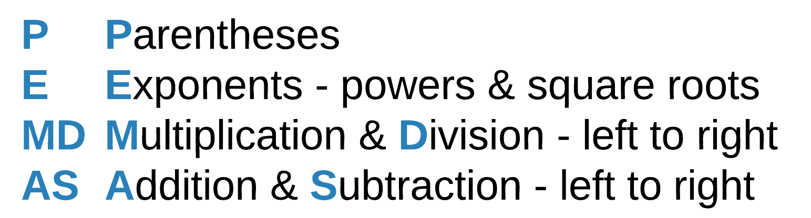
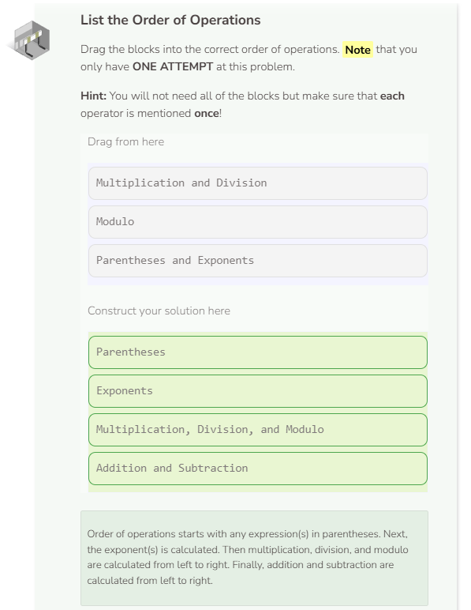

# Lab: Order of Operations
## Tutorial Lab 3: Order of Operations
C++ uses PEMDAS when determining the order of operations.

Since modulo is based on division, modulo operations happen at the time of multiplication and division, going from left to right.

Below are the steps that C++ takes when evaluating the code above.
1. 5 * 8 / 3 + (18 - 8) % 2 - 25
2. 5 * 8 / 3 + 10 % 2 - 25
3. 40 / 3 + 10 % 2 - 25
4. 13 + 10 % 2 - 25
5. 13 + 0 - 25
6. 13 - 25
7. -12

