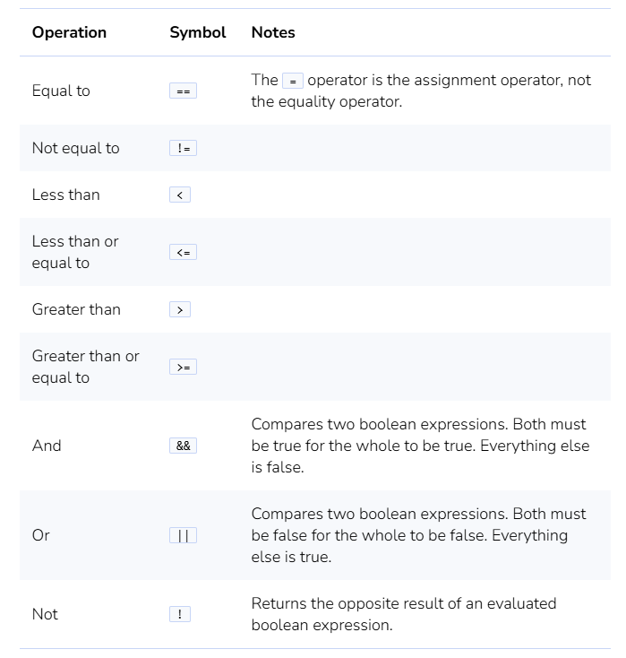
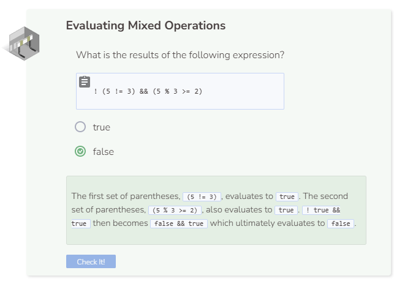

# Lab: Boolean Operators
## Tutorial Lab 4: Boolean Operators
Boolean operators are used within expressions to return either `true` or `false`.

**Evaluate all arithmetic operators according to PEMDAS**
1. (5 > 7) && (false || 1 < 9) || 4 != 5 && ! (2 >= 3)
2. false && (false || 1 < 9) || 4 != 5 && ! (2 >= 3)
3. false && (false || true) || 4 != 5 && ! (2 >= 3)
4. false && (false || true) || true && ! (2 >= 3)
5. false && (false || true) || true && ! false

**Evaluate all boolean operators according to this order - Parentheses (()), Not (!), And (&&), then Or (||)**
1. false && true || true && ! false
2. false && true || true && true
3. false || true && true
4. false || true
5. true
Note that arithmetic operators are performed before boolean operators.

