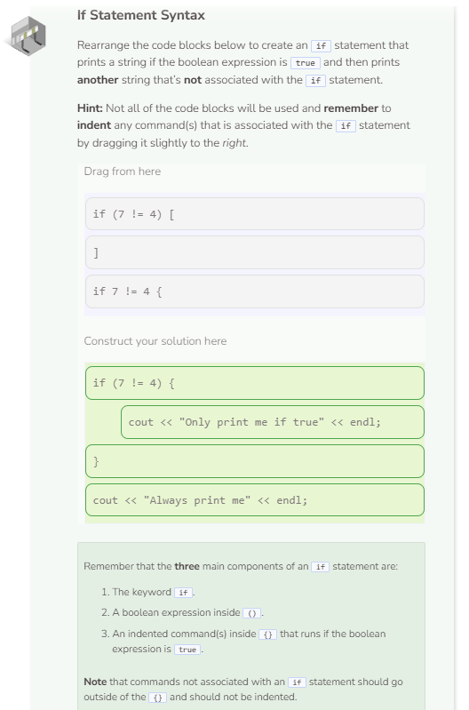

# If Statement Syntax
## If Statement Syntax
Conditionals are pieces of code that make a decision about what the program is going to do next. The most common conditional is the `if` statement.

If statements in C++ must contain the following items:
- The keyword `if`.
- A boolean expression in parentheses, `()`.
- Curly braces, `{}`, surrounding all lines of code that will run if the boolean expression is true.

It is best practice to also indent the lines of code inside the curly braces to visually differentiate them from the commands that will always run.

