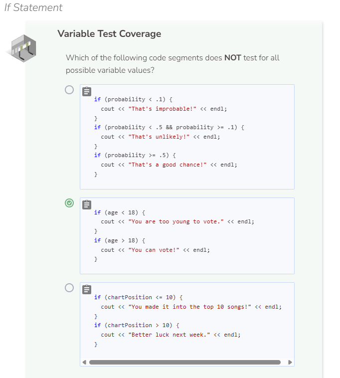
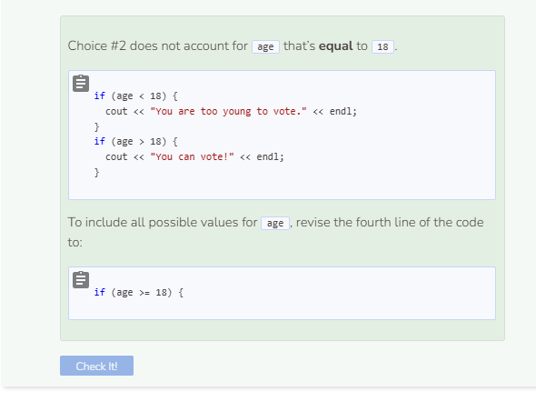

# If Statement
## If Statement
`if` statements test to see if a certain condition is true. If yes, then specific commands are run. The simple `if` statement does not do anything if the boolean expression is false.

## Testing Multiple Cases
You will find yourself needing to test the same variable multiple times. Be sure that you set up your conditionals to test all possible values of the variable.

