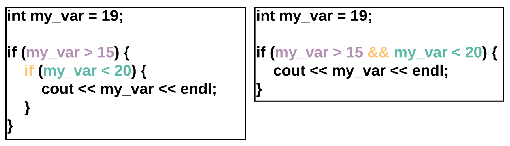
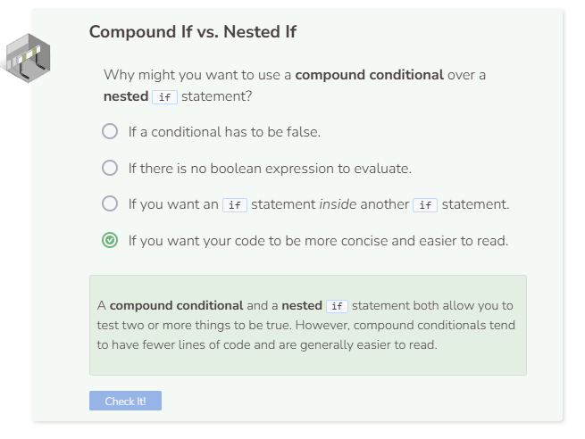

# Compound Conditional Statements
## Compound Conditional Statements
Conditional statements (`if` statements) are used to match an action with a condition being true. For example, print `Even` if a number is even. If you want to test for a number being even and greater than 10, you will need two conditionals.

## Why Use Compound Conditionals?
Both code snippets below do the same thing: Ask if `my_var` is greater than 15 and if `my_var` is less than 20. If both of these are true, then C++ will print the value of `my_var`.

The code on the left is a nested `if` statement - which means an `if` statement is inside another `if` statement.
The code with the compound conditional (on the right) has fewer lines of code, and is easier for a human to read. In fact, it almost reads like a sentence.

