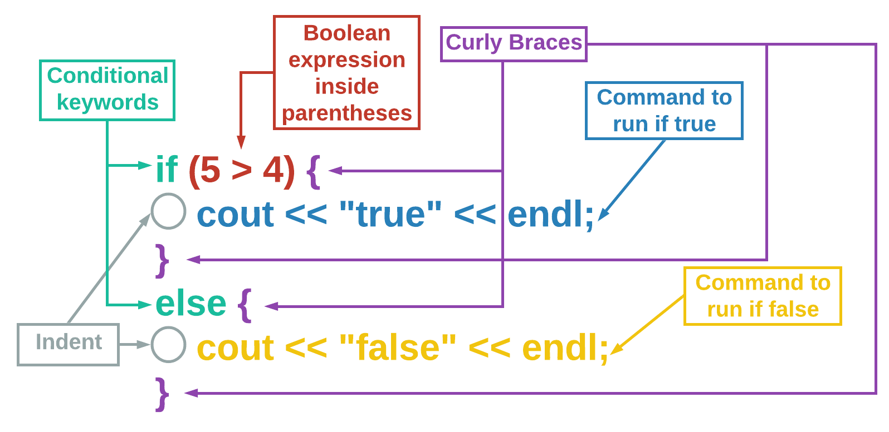
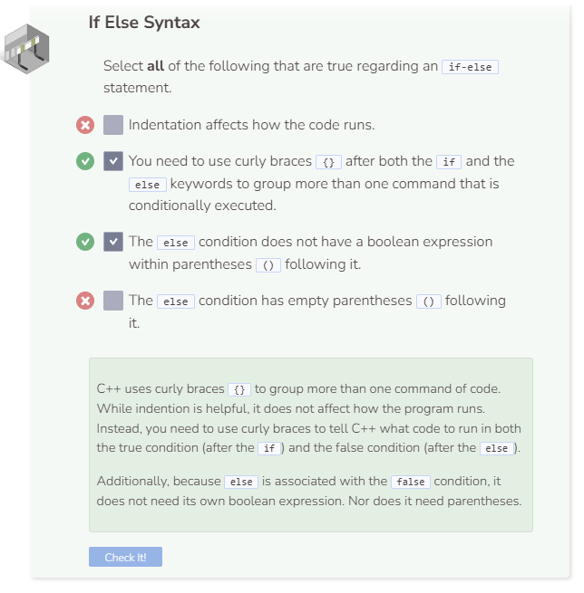

# If Else Statement Syntax
## If Else Syntax

The `if-else` statement checks to see if a condition is true, and then has specific actions that take place. However, it also provides a specific set of actions if the boolean expression is false. Use the else keyword to introduce the code to run when false is evaluated. Note that `else` is aligned with the if keyword (no indentation) and has its own set of curly braces `{}`. You do not write another boolean expression with `else`.



It is best practice to indent the lines of code within the curly braces to differentiate them but the indention does not affect how the program runs.

You may have noticed that when there is only one command associated with an `if` or `else` statement the curly braces `{}` become optional.

## When Are Curly Braces Mandatory?
Curly braces `{}` are mandatory whenever you have more than one command that is associated with an if or else statement. Here is a code snippet that will work without curly braces:

```cpp
if (10 % 2 == 0)
  cout << "10 is even" << endl;
else
  cout << "10 is odd" << endl;
```

Like indentations, it is best practice to always include curly braces even if they are optional in certain situations.

```cpp
if (10 % 2 == 0) { // mandatory curly braces
  cout << "10 is even" << endl;
  cout << "True" << endl;
}
else { // optional curly braces
  cout << "10 is odd" << endl;
}
```

