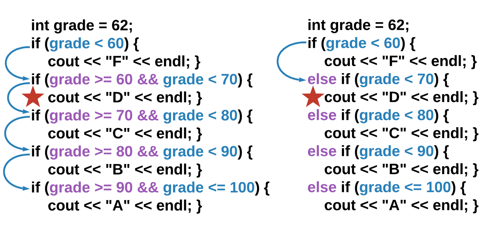
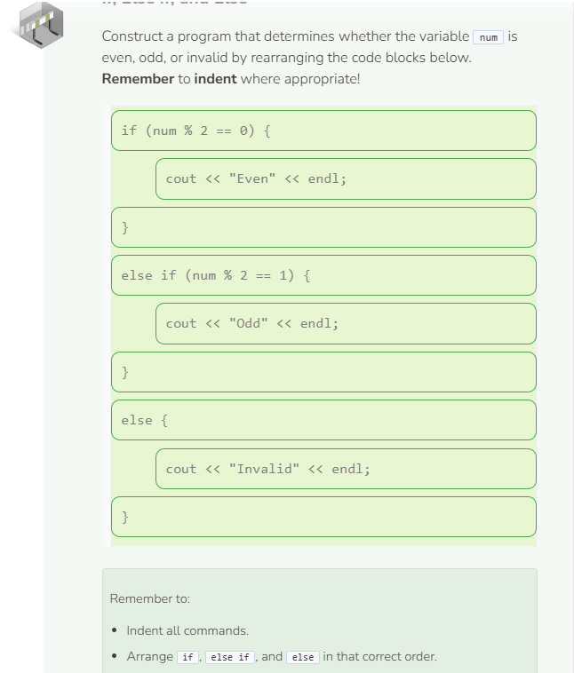

# If Else Statement
## If Else Statement
The `if-else` statement is used when you want something specific to happen if the boolean expression is true and something else to happen if it is false.

Remember that curly braces `{}` are optional if the `if-else` statement only includes one command within the `if` and `else` bodies. However, they are mandatory when there is more than one command. When using curly braces, the decision of where to place them is entirely up to you. All of the commands below work exactly the same way:

## Testing Multiple Cases
You will find yourself needing to test the same variable multiple times. To simplify this, you can nest `if-else` statements – which means you can put an `if-else` structure inside of another `if-else` structure (as shown on the right below).

When nesting `if` and `else` together, use the keywords `else` and `if` side-by-side (`else if`). This nesting drastically changes the way the program flows once the correct case is found. On the left, the program checks every case no matter the value of the variable. On the right, the nested structure causes the program to jump out of the structure once the correct case is found. This is able to occur because the other if cases are inside the else statement, which will only run when the previous boolean expression is false.

