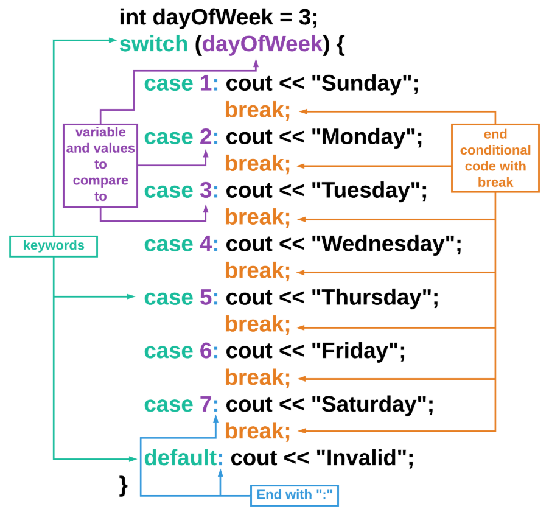
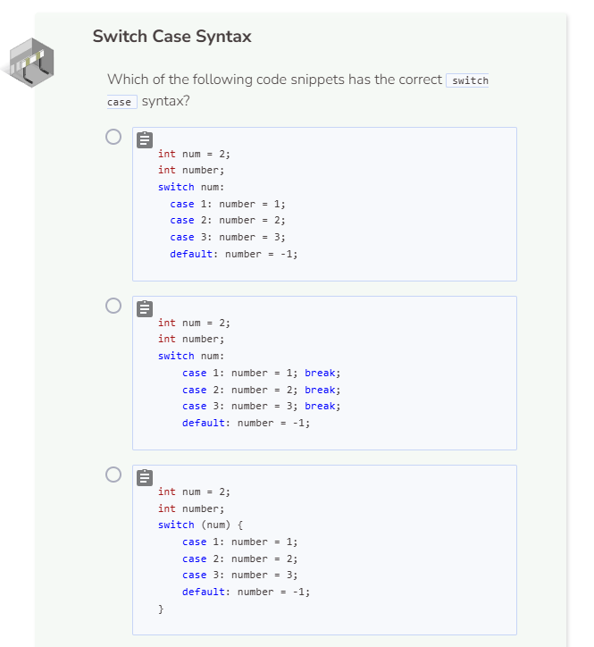
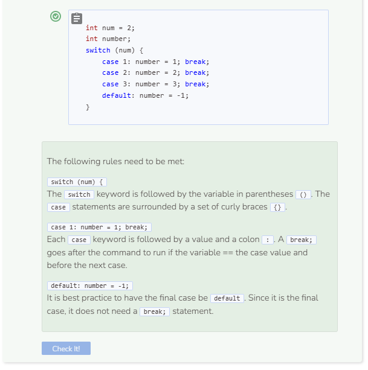

# Switch Case Statement Syntax
## Switch Case Statement Syntax
The `switch case` statement is a way to make a decision with multiple possible outcomes. Instead of nesting or sequencing many `if` statements, C++ allows you to write the following:

Here are the rules for writing a switch case statement:
- Start with `switch` followed by the variable that is going to be tested in parentheses `()`.
- All of the `case`s are surrounded by a set of curly braces `{}`.
- Each `case` is followed by a numerical value and a colon `:`.
- After each `:`, write the code that should run if the variable is equal to that case’s value.
- After each section of code per case, include `break;`.
- As the very last case, use `default:` to specify what should happen if none of the above cases are true.

