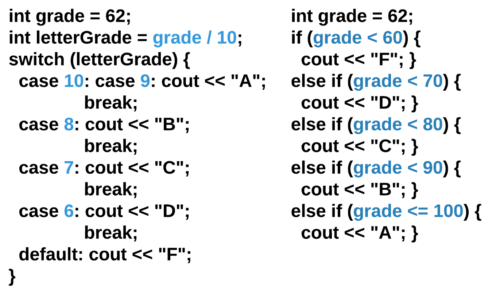
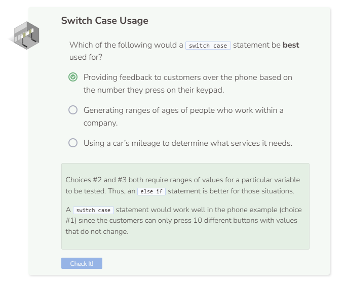

# Switch Case vs. Else If
## Switch Case vs. Else If
C++ allows you to use either `switch case` or a series of `else if` statements to handle decisions with multiple outcomes. There are a couple of reasons why you would use one method over the other.

### 1: Else If is used for ranges of values - Switch Case is for specific values
`switch case` can only check for equality (e.g. `num == 5`), so if you need to check for a range of values (e.g. `num > 50 && num <= 60`), use else If instead.



Sometimes, the code for multiple cases is the same. Instead of repeating code, you can list multiple cases before the code. Here is another example:

```cpp
int month = 2;
int year = 2000;
int numDays = 0;

switch (month) {
  case 1: case 3: case 5:
  case 7: case 8: case 10:
  case 12:
    numDays = 31;
    break;
  case 4: case 6:
  case 9: case 11:
    numDays = 30;
    break;
  case 2:
    if (((year % 4 == 0) &&
       ! (year % 100 == 0)) ||
         (year % 400 == 0))
         numDays = 29;
    else
      numDays = 28;
      break;
  default:
    cout << "Invalid month.";
    break;
}
cout << "Number of Days = " << numDays << endl;
```

In some cases, as shown above, you can exploit patterns to force ranges into a switch case, but frequently that is not possible and it also makes the code less readable. For example, above, the user has to realize that letterGrade is using integer division to retrieve the tens place of the original grade.

```cpp
int grade = 62;
int letterGrade = grade / 10;
switch (letterGrade) {
  case 10: case 9: cout << "A"; 
          break;
  case 8: cout << "B"; 
          break;
  case 7: cout << "C"; 
          break;
  case 6: cout << "D"; 
          break;
  default: cout << "F";
}
```

### 2: Else If is used for handling multiple variables
`switch case` can only compare against values - not variables. For example, if you wanted to compare the inputted day of the week with the current day of the week, you would need to use `else if`. `switch case` can handle values (`dayOfWeek == "Sunday"`) but not variables (`dayOfWeek == today`).

### 3: Else If is used for compound conditionals
To check multiple conditions, an `else if` is needed.
Below is an example of a multiple choice grader using `switch case`:

```cpp
int studentAnswer = 3;
string feedback1 = "This answer is wrong because....";
string feedback2 = "This answer is correct! You know this because...";
string feedback3 = "This answer is wrong. While the first part is correct...";
string feedback;

int correctAnswer = 2;
int points = 0;

switch (studentAnswer) {
  case 1: feedback = feedback1; break;
  case 2: feedback = feedback2; break;
  case 3: feedback = feedback3; break;
  default: feedback = "Invalid answer choice";
}

cout << feedback << endl;
```


