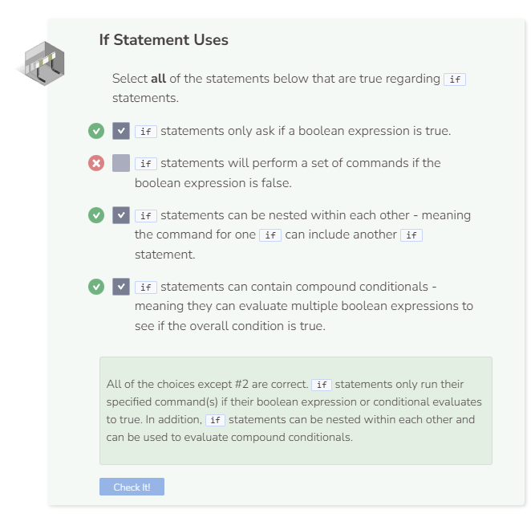

# Lab: If Statement
## Tutorial Lab 1: If Statements
The `if` statement allows for your program to make a decision about what it should do. It asks a simple question: “Is this condition true?” If yes, then the computer will execute certain commands.

An `if` statement is comprised of the keyword `if`, followed by a boolean expression surrounded by parentheses `()`. Any code that should run if the boolean expression is true is surrounded by curly braces `{}`. It is best practice to indent this code, but it does not affect how the code runs.

If the boolean expression is false, the code in curly braces is skipped, and the program continues as normal.

`if` statements can be used to test multiple conditions. These conditions exist as boolean expressions inside the parentheses `()`. In addition, an `if` statement can exist inside another `if` statement. Both blocks of code below accomplish the same exact task.

