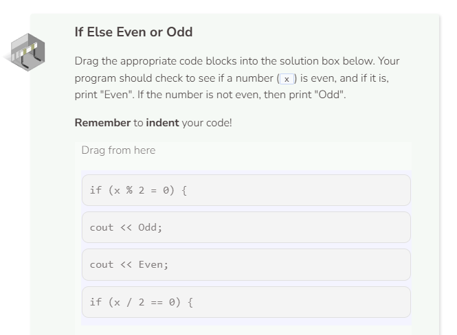
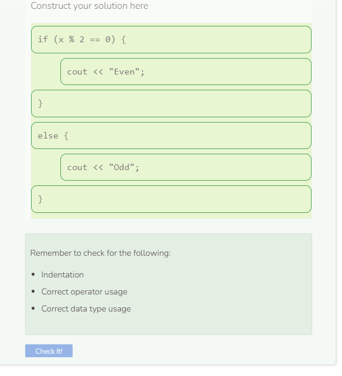

# Lab: If Else Statement
## Tutorial Lab 2: If Else Statements
The `if else` statement gives your program the ability to ask a question, perform certain actions if the answer is true, and then perform another set of actions if the answer is false.

```cpp
int x = 10;

if (x > 50) {
  cout << to_string(x) + " is greater than 50" << endl;
}
else {
  cout << to_string(x) + " is less than 50" << endl;
}
```

The `if` part of the `if else` statement is written as before. The `else` keyword is not indented; it should be aligned with the `if` keyword. `else` is followed by an open curly brace `{`. You do not use a boolean expression with `else`. All code that should run when the boolean expression is false should go before the closing curly brace `}`.

Be careful when expressing your boolean expression in terms of "less than or greater than". This does not take into account when the values being compared are equal. Consider the code from above, but with `x` having the value of `50`.

```cpp
int x = 50;

if (x > 50) {
  cout << to_string(x) + " is greater than 50" << endl;
}
else {
  cout << to_string(x) + " is less than 50" << endl;
}
```

The output of the program does not make sense. `50` is not less than `50`. Sometimes using `<=` and `>=` need to be used. Another solution is to update the output to be more inclusive such as replacing `is less than 50` with `is less than or equal to 50`. In either case, be sure to think through all of the possible outcomes, and make sure your code can function properly in all of those scenarios.



