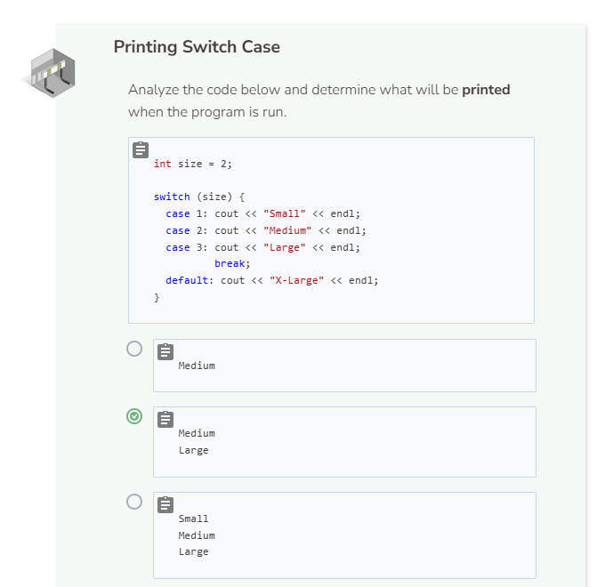
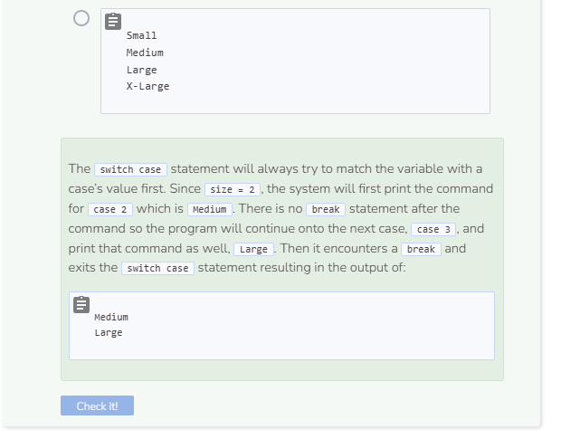

# Lab: Switch Statement
## Tutorial Lab 3: Switch Statement
The `switch case` statement gives your program the ability to perform different actions based on the value of a given variable.

The variable used to make the decision is in parentheses following the `switch` keyword. Inside curly braces, the cases listing the different values to check are followed by a `:` and then the code that should run if the variable is equal to that case’s value comes next. The last case, `default`, runs if none of the other cases are true. Each code segment except the last one ends with `break;` to signal the program to jump to the closing curly brace.

Remember to include `break;` statements at the end of each case. Check out what happens when you remove them.

```cpp
int size = 3;

switch (size) {
  case 1: cout << "Short";
  case 2: cout << "Tall";
  case 3: cout << "Grande";
  case 4: cout << "Venti";
  case 5: cout << "Trenta";
  default: cout << "Grande";
}
```
The output of the program does not make sense because the program continues through all of the cases after the initial case is matched to a value. In the example above, the program prints the command for `case 3` as well as all of the commands that follow.


