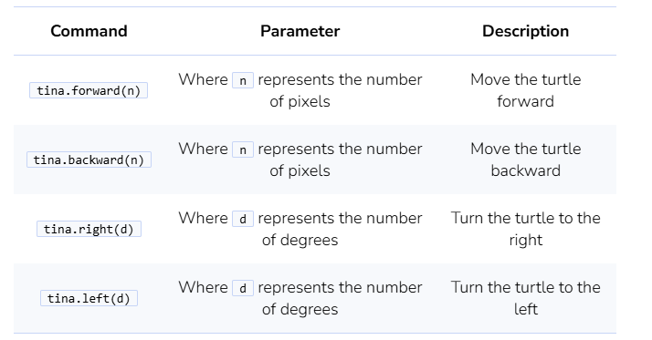
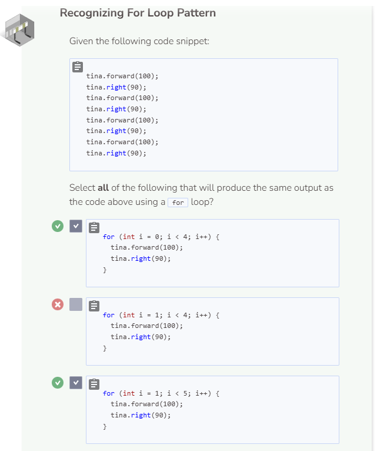
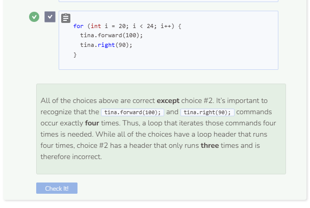

# Turtle Graphics

Before continuing with loops, we are going to learn how to create graphical output with the Turtle Graphics library. Like a pencil on paper, the turtle object leaves a line as it moves around the screen.

## Turtle Syntax

The first step is to create a screen for the turtle to move around in using the command `TurtleScreen` followed by a variable name to call that screen (i.e. `screen`). In parentheses after `screen`, you can specify the dimensions of the screen in terms of width and height respectively (i.e. 400, 300). Then we can create our turtle using the command `Turtle` followed by a variable name for that turtle (i.e. `tina`). Finally in parentheses, we put in `screen` to associate the turtle with the screen that we created previously. The code below produces a turtle and a screen for the turtle to move around in.

```cpp
TurtleScreen screen(400, 300); //width 400 pixels and height 300 pixels
Turtle tina(screen); //creates a turtle named tina inside the screen
```

```cpp
#include <iostream>
#include "CTurtle.hpp"
#include "CImg.h"
using namespace cturtle;
using namespace std;
```
The header above enables you to use the Turtle Graphics library as well as the C Image library. Thus, the header should never be altered.

## Turtle Commands
In order to view the turtle object, it is not enough just to create it. You must give instructions to the turtle object in order for it to “move” around the screen. Here is a list of basic turtle commands that you can give to tina the turtle object:



### What does the `screen.exitonclick()` command do?
By default, the screen will close itself automatically once the program reaches the end of the code. However, if you want the screen to remain open, you can use `screen.exitonclick()` to tell the program to keep the screen open until the screen is clicked with a cursor. Go ahead and try clicking on the screen.



