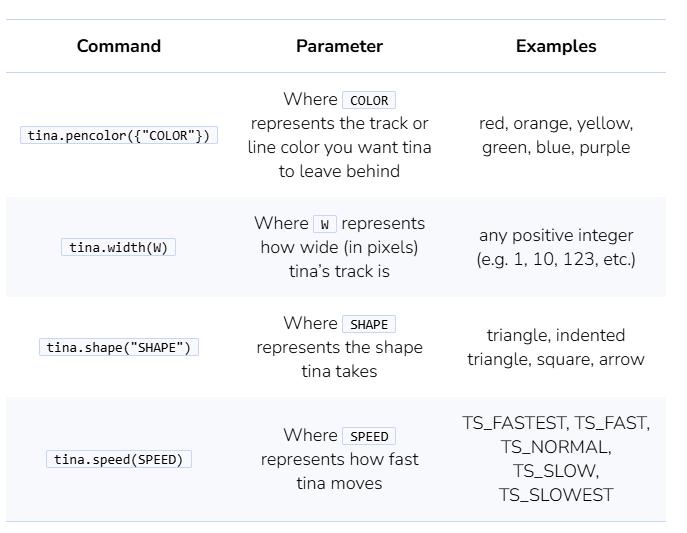
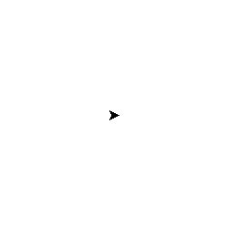
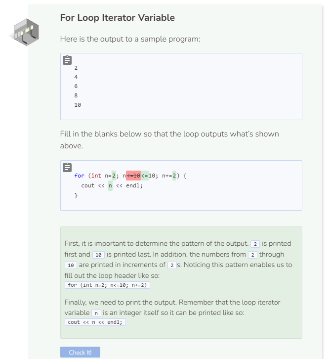

# Turtle Coding: For Loop
## Customize Your Turtle
You may choose to change the dimensions of your turtle screen whenever you’d like. Also, the following table provides additional commands you can use to customize `tina` the turtle.

## Turtle Challenges
### Challenge 1

There are multiple ways to accomplish this task but the trick lies within finding the pattern and then repeating it a specific number of times. One pattern in particular is to:
- Go forward (creating a long line).
- Make a right turn.
- Go forward (creating a small line).
- Make a right turn.
- Go forward (creating another small line).
- Make a right turn.
- Go forward (creating a final small line).
- Repeat steps #1 through #7 three more times for a total of four iterations.

### Challenge 2

Since a circle has 360 degrees, you will need a loop that repeats 360 times. Be careful about how far the turtle moves forward and turns. The circle can get very big, very quickly.

### Challenge 3

The trick lies within the fact that the distance the turtle moves has to get larger as the loop advances. Think of some operators that you can use to make the loop iterator variable get bigger during each iteration.

