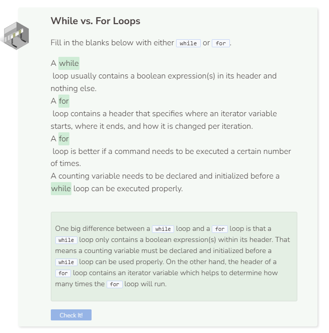

# While Loops
## While Loops Syntax
`while` loops, like `for` loops, use curly braces `{}` and indents for all commands that should be repeated. However, for loops generally contain 3 elements (an initialized variable, a boolean expression involving that variable, and a change in the value of that variable) while a `while` loop usually contains just a boolean expression. The `for` and `while` loops below produce the same results.

```cpp
int i = 0;
while (i < 5) {
  cout << "Loop# " << i << endl;
  i++;
}
```
Note that the variable declaration and initialization happen before the start of the `while` loop and any changes that occur to the variable happen within the body of the curly braces `{}`. On the other hand, everything happens in one step within parentheses `()` when using a `for` loop.

## How does `while (count > -1 * count)` work?
To understand how the loop works, it's best to substitute values in for the variable `count`. In the first iteration, we have `while (5 > -1 * 5)`, this statement is true so the print command is executed. Since `count` gets decremented by 1 with each iteration, the while loop condition changes slightly every time like as follow:
- `while (4 > -1 * 4)`
- `while (3 > -1 * 3)`
- `while (2 > -1 * 2)`
- `while (1 > -1 * 1)`
Once the condition gets to `while (0 > -1 * 0)`, it no longer holds true and the while loop ends. The result is 5 `Hellos` being printed to the screen.

## Infinite Loops
Infinite loops are loops that do not have a test condition that causes them to stop. The following is a common mistake that results in an infinite loop:
```cpp
int count = 5; // some random number set by user
while (count > 0) {
  cout << "Hello" << endl;
}
```

Since the variable `count` never gets decremented. It remains at 5, and 5 will forever be greater than 0, so the loop will never stop.

## Why Use a While Loop?
If a `while` loop does the same thing as a `for` loop, then what is the purpose of having both? while loops are actually more useful when you are waiting for a certain event to occur. Imagine you are making a video game. The game should continue until the player loses all of their lives. You don’t know how long this will take, so a while loop is more appropriate. On the other hand, if you have more specific loop parameters, a for loop will be better.

```cpp
int player_lives = 3;

while (player_lives > 0) {
  // video game code
  // goes here
}
```

