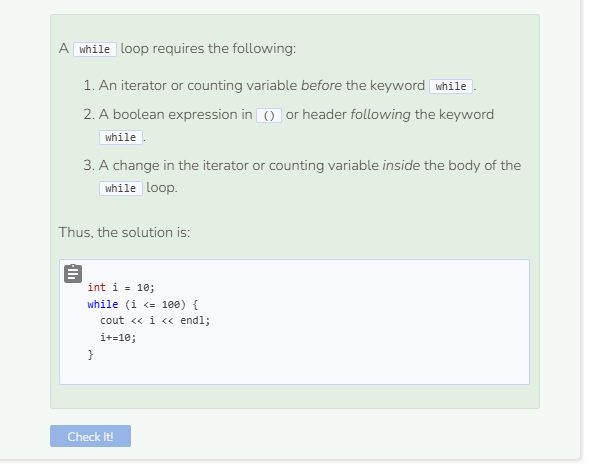

# Turtle Coding: While Loop
Instead of a `for` loop, recreate the images below using a `while` loop.
- `tina.forward(n)` - Where `n` represents the number of pixels.
- `tina.backward(n)` - Where `n` represents the number of pixels.
- `tina.right(d)` - Where `d` represents the number of degrees.
- `tina.left(d)` - Where `d` represents the number of degrees.
- `tina.pencolor({"COLOR"})` - Where `COLOR` represents the track or line color you want tina to leave behind.
- `tina.width(W)` - Where `W` represents how wide (in pixels) tina's track is.
- `tina.shape("SHAPE")` - Where `SHAPE` represents the shape tina takes.
- `tina.speed(SPEED)` - Where `SPEED` represents how fast tina moves

## Sample Solutions

```cpp
  tina.pencolor({"blue"});
  tina.width(2);
  tina.shape("arrow");
  tina.speed(TS_SLOWEST);
  
  int i = 0;
  while (i < 4) {
    tina.forward(75);
    tina.right(90);
    tina.forward(25);
    tina.right(90);
    tina.forward(25);
    tina.right(90);
    tina.forward(25);
    i++;
  }
```

```cpp
  tina.pencolor({"red"});
  tina.width(2);
  tina.shape("square");
  tina.speed(TS_FASTEST);
  
  int i = 0;
  while (i < 360) {
    tina.forward(1);
    tina.right(1);
    i++;
  }
```

```cpp
  tina.pencolor({"green"});
  tina.width(2);
  tina.shape("triangle");
  tina.speed(TS_NORMAL);
  
  int i = 10;
  while (i <= 200) {
    tina.forward(i);
    tina.right(90);
    i+=10;
  }
```


