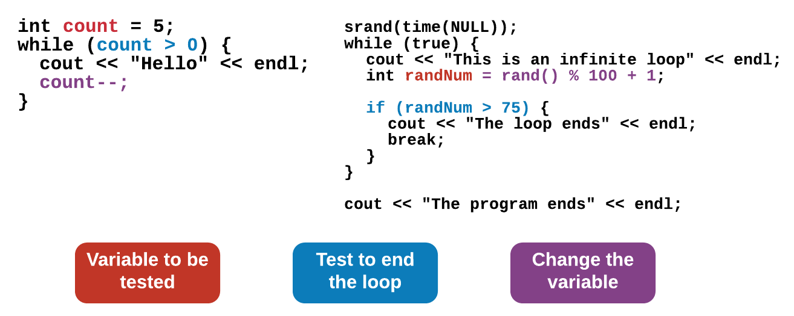
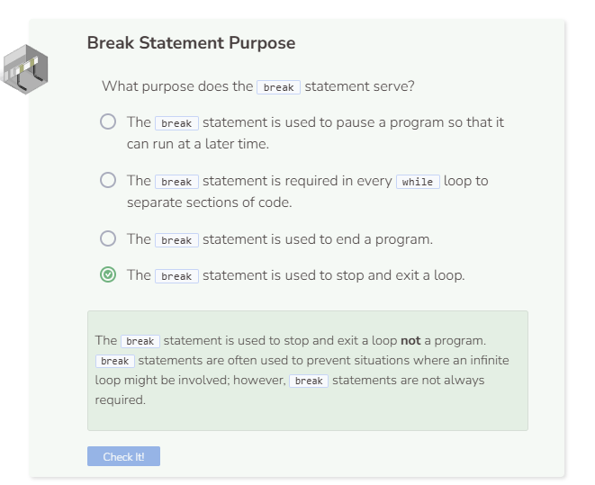

# Break Statement
## Infinite Loops Are Bad, Right?
Well, that depends. If an infinite loop is caused because the counting variable isn’t incremented, then it’s a bug. However, some programmers purposely create a condition that will always evaluate to true. Therefore, the loop will always run. In such cases, a `break` statement is used to stop the loop at a particular point in the program.

Even though `while (true)` will always evaluate as a true statement, the loop never becomes infinite because of the `break` statement.

## Comparing While Loops
The `while` loops introduced on the previous pages look different from the while loop covered on this page; however, they both have the same components and behave similarly.

