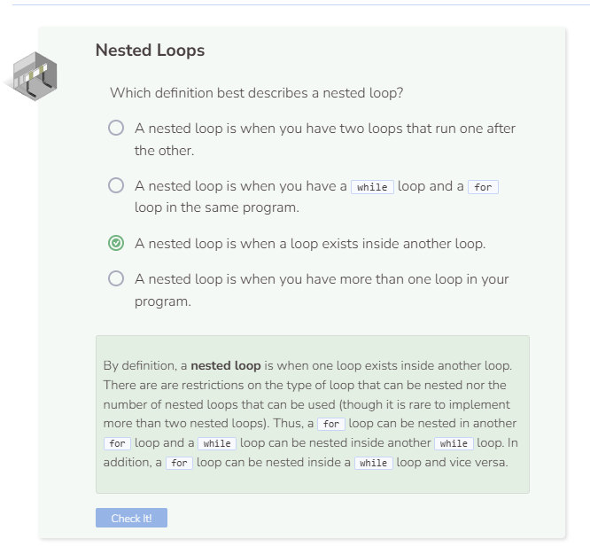

# Nested Loops
A nested loop is a loop that exists inside of another loop. An advantage of using nested loops is that the loops can work together to create unique and complex outputs. However, due to their complexity potential, it is rare to see the implementation of more than two nested loops. If possible, it is recommended that you re-factor your code to reduce this complexity.

## Syntax
The code below will draw a rectangle of 100 `#` in a 10 x 10 grid. The first loop controls the row of output, while the second loop prints 10 `#` to the screen.

```cpp
for (int row = 0; row < 10; row++) { //outer loop
  for (int col = 0; col < 10; col++) { //inner loop
    cout << "#";
  }
  cout << "" << endl; //adds new line
}
```

