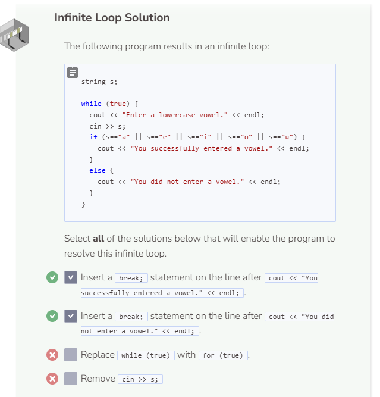
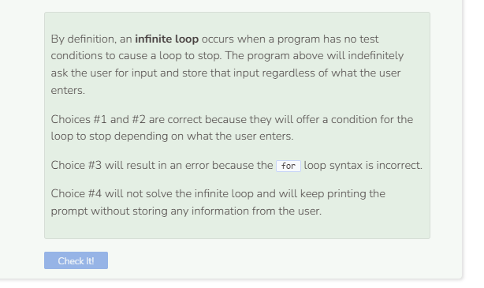

# Lab: Break Statement
## Tutorial Lab 3: Breaking from the While Loop
What does `cin >> input;` do?
- The `cin >> input;` command records what a user enters on the screen and stores that information in the variable input. Note that input is of type double.

What do `cin.good()` and `cin.fail()` do?
- `cin.good()` checks to see if the input entered by the user was successful while `cin.fail()` checks to see if the input failed. Since input is of type double, only numerical values entered by the user will cause cin >> input to be successful, anything else will cause the input to fail.

```cpp
double result = 0;
double input;

while (true) {
  cout << "Enter a number to add to sum. "; 
  cout << "Or enter a non-number to quit and calculate sum." << endl;
  cin >> input;
  if (cin.good()) {
    result += input;
  }
  if (cin.fail()) {
    cout << "Sum = " << result << endl;
    break;
  }
}
```

- Declare the variable result and initialize it to 0. result will store the total of the summation.
- Declare the variable input. input will store the information that the user enters.
- Next we set up a while loop with true as the expression in the loop header. We do this because we want the loop to continue running and storing information from the user. Since we don’t know how much information the user will enter, a while loop is best for the situation.
- The user is prompted to enter some information and that information is stored in the variable input which was declared earlier.
- If the information was stored into input successfully, the value in input will be added to the value in result, our total summation.
- If the information was not stored into input successfully, then the program will print out the total summation result and exit the while loop.


