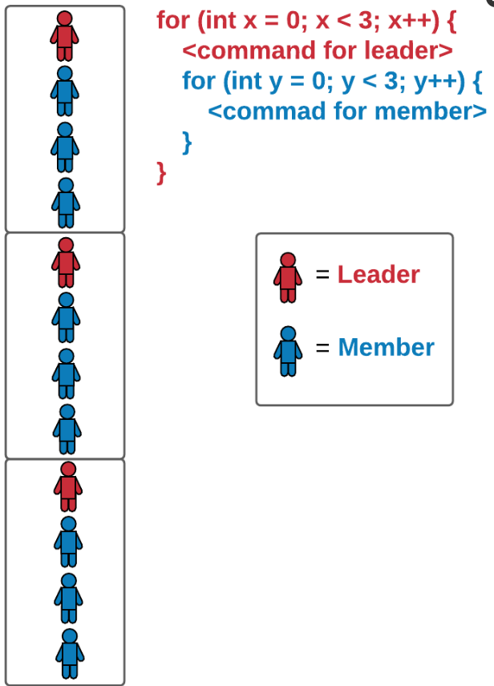
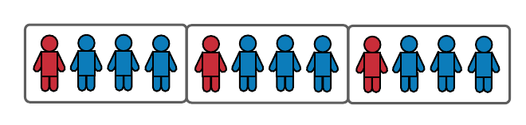

# Lab Challenge: Loop Patterns
## Nested Loop Example
One of the benefits of nested loops is that they can be used to construct complex patterns. Imagine a classroom full of students and they are distributed evenly into smaller groups and asked to form a single line with their groups. The outer loop is like the group leader (represent in red and L) and the inner loop is like the rest of the group members (represented in blue and M.



```cpp
for (int x = 0; x < 3; x++) {
  cout << "L" << endl;
  for (int y = 0; y < 3; y++) {
    cout << "M" << endl;
  }
}
```

What is the pattern described by the above example? There are 3 leaders and each leader has 3 members. However, note that the example shows the students standing in a vertical line. What if you want to arrange the students in a horizontal line like this instead?



```cpp
for (int x = 0; x < 12; x++) {
  if ((x == 0) || (x == 4) || (x == 8)) {
    cout << "L";
  }
  else {
    cout << "M";
  }
}
```

## Nested For Loop Challenge
Assignment:
For this challenge, you will use your knowledge of patterns, conditionals, and nested for loops to produce the following output:
```
XOXOXOXOX
OXO
OXO
XOXOXOXOX
OXO
OXO
XOXOXOXOX
OXO
OXO
```
Requirement:
Your program must include at least two for loops, one nested within another, in order to receive credit. In addition, you are only allowed to use, at most, two cout statements.

The pattern can be identified as follow. There is one line of XOXOXOXOX following by two lines of OXO. Thus, we will need an outer for loop like for (int x = 0; x < 1; x++). The outer loop will only run once. On the other hand, the inner loop needs to run twice, thus something like for (int y = 0; y < 2; y++) is needed. The outer loop should print XOXOXOXOX whereas the inner loop should print OXO. However, these two nested loops will only produce the output:

```
XOXOXOXOX
OXO
OXO
```

To iterate or repeat the pattern three times, we will have to modify the outer loop to run three times instead of once. Thus, all we have to do is change the outer loop header from x < 1 to x < 3. Here is one possible solution:

```cpp
for (int x = 0; x < 3; x++) {
  cout << "XOXOXOXOX" << endl;
  for (int y = 0; y < 2; y++) {
    cout << "OXO" << endl;
  }
}
```

Alternatively, if you don’t want to modify the existing nested loops, you can nest them inside another loop that runs three times. Here is another potential solution:

```cpp
for (int z = 0; z < 3; z++) {
  for (int x = 0; x < 1; x++) {
    cout << "XOXOXOXOX" << endl;
    for (int y = 0; y < 2; y++) {
      cout << "OXO" << endl;
    }
  }
}
```

Note that the outermost loop for (int z = 0; z < 3; z++) doesn’t actually produce any output, it just runs three times, causing the identified pattern to print three times as well.