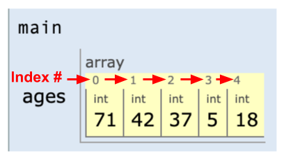
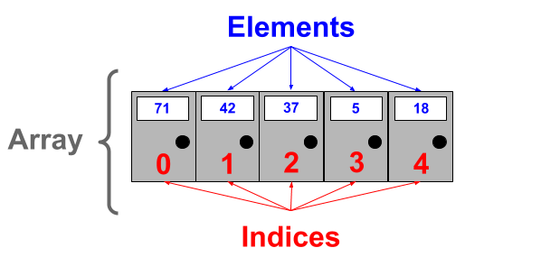
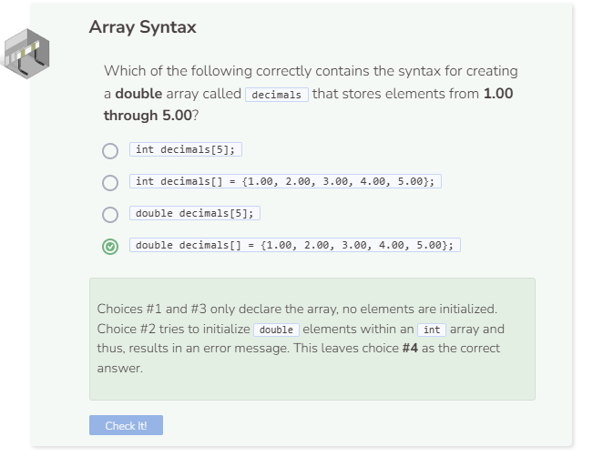

# Creating an Array
## What Is an Array?
Before we discuss vectors, we will first learn about arrays, a simpler form of a vector. An array is a data structure that stores a collection of data such as ints, doubles, strings, etc. This data is often referred to as the array’s elements. Being able to store elements into an array helps reduce the amount of time needed to declare and initialize variables. For example, if you wanted to store the ages of all family members in your household, you would typically have to declare and initialize integer variables and values for each family member.

## Array Creation
To avoid the repetitive task of declaring and initializing multiple variables, you can declare an array and directly assign values or elements into that array like below.

```cpp
int ages[] = {71, 42, 37, 5, 18};
```


### Method Syntax with Elements:
- Specify the data type that the array will store (i.e. `int`).
- Declare the variable name for the array (i.e. ages) followed by empty brackets `[]` followed by the assignment symbol `=`.
- Elements assigned to the array are separated by commas , and enclosed within curly braces `{}`.

Notice that the array variable ages refers to all of the elements as a collection. An array is considered to be a collection that bundles all of the data that it holds.



Note that the first array slot, or index, is always 0 so 71 is located at index 0 instead of 1.

Alternatively, you can create an array without any elements in which you will need to declare and specify the array variable name and size before you can assign elements to the array.

```cpp
int ages[5];
```

### Method Syntax without Elements
- Specify the data type that the array will store (i.e. `int`).
- Declare the variable name for the array (i.e. `ages`) followed by the number of elements you want the array to hold within brackets (i.e.`[5]`).

Note that when you declare an array without initializing any elements, the system will still reserve enough memory for the array to hold the specified number of elements. This means that you can initialize elements within the array later on.

## Array Details
If an element within an array has not been initialized yet, printing it will cause the system to output random memory data. Random memory data is often generated when array elements are not initialized.

```cpp
int ages[5];
cout << ages[0] << endl;
```

Note that `ages[0]` in the example above refers the element at index `0`, also known as the first position within the array. Currently, the element at the first position is not initialized so printing the first element will only output random memory data. In fact, the same will happen if you try to print any other elements within the array. Additionally, all elements within the array must be of the same type. If you try to store a string within an integer array, or a double within a boolean array, you will get an error message.

When you create an array in C++, you must specify the number of elements that you expect the array to hold. Otherwise, you will get an error.

P.O. Boxes at the postal office are symbolically similar to arrays. Each row of P.O. Boxes is like an array, except each box can only store one item (element) and each item within that row must be of the same type (i.e. integers).




