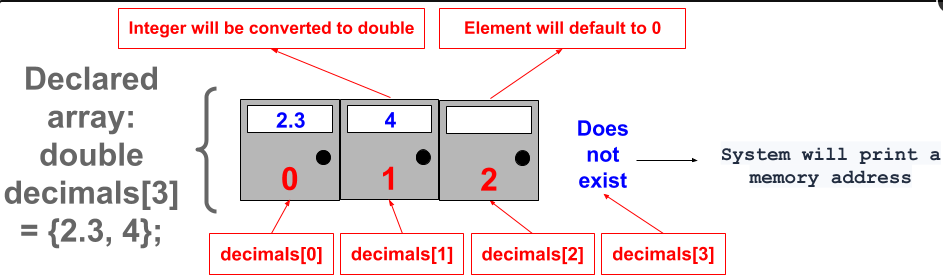
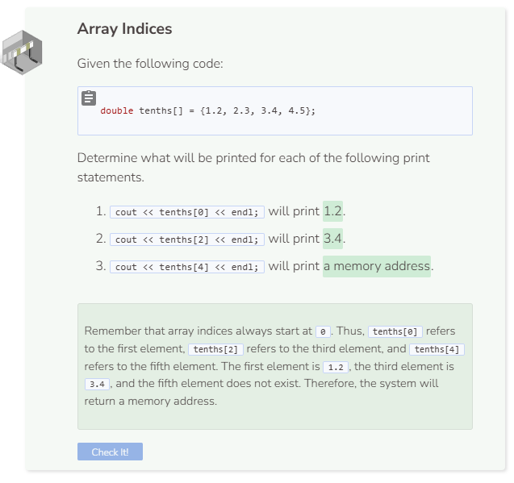

# Accessing an Array
## Array Access
To access and print array elements, you need to know their position. The position at which an element is stored is called its index. For example, `names[0]` refers to the first element in the array called `names`. Array indices always start at 0 and increment by 1 with each element that comes next. Due to this, `numbers[4]` refers to the fifth element in the array, not the fourth.

```cpp
string names[] = {"Alan", "Bob", "Carol", "David", "Ellen"};

cout << names[0] << endl;
```

You may have noticed that printing the `names` array without specifying an index resulted in an output that included a mixture of numbers and letters. This occurs because printing an array actually prints its memory location, not its elements. You’ll learn how to print all elements in an array without having to specify all of their indices on a later page.

## Array Key Points

What happens if you:
- Change `bools[0]` in the original code to `bools[1]`?

The system will print 0 because `bools[1]` refers to the second element in the bools array. Remember that 0 is the integer equivalent to false and 1 is the integer equivalent to true. To print their respective boolean equivalent, use `cout << boolalpha << bools[1] << endl;` instead.

- Change `bools[0]` in the original code to `decimals[1]`?

The system will print 4 because `decimals[1]` refers to the second element in the decimals array.

- Change `bools[0]` in the original code to `integers[1]`?

The system will print random memory data because `integers[1]` is not valid within the integers array. Currently there is only one element at the first index which has not been formally initialized yet.

- Change `int integers[1];` in the original code to `int integers[1] = {1.2};` and `cout << bools[0] << endl;` to `cout << integers[0] << endl;`?

The system will return an error message. Though you have tried to initialize the first element within the `integers` array to `1.2`, the system will not allow you to put a double element into an integer array. However, it is possible to put an integer element into a double array because integers can be expressed as doubles but not vice versa.

Here are some key points to keep in mind when working with arrays:
- When you declare an array, you must specify the number of elements you wish the array to hold before you can initialize any elements. One exception is if you declare and initialize the array and elements at the same time. Doing so means you do not need to specify the number of elements in brackets [] since the system will determine that based on the number of elements you have initialized.
- If you do not initialize any elements, printing the elements will only result in random memory data.
- If you try to access an element position that is not valid (i.e. the second element in the integers array), the system will also output random memory data.
- Elements must be of the same type as the array. The only exception is that integers can be expressed as doubles and can therefore be put into a double array.






