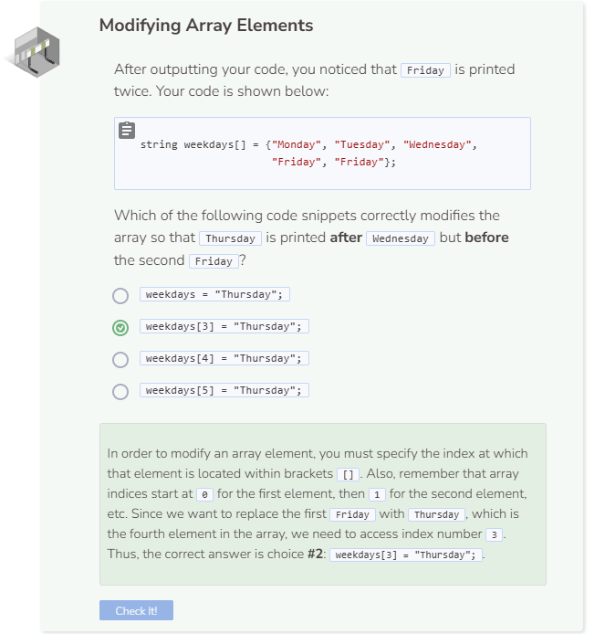

# Modifying an Array
## Array Modification
To modify an element within an array, simply find the index at which that element is stored and assign a new value to it.

```cpp
int grades[] = {85, 95, 48, 100, 92};
cout << grades[2] << endl;

grades[2] = 88; //88 will replace 48 at index 2
cout << grades[2] << endl;
```

## Modifying Multiple Arrays
You can create and modify as many arrays as you’d like. For example, you can create an array to store your family members and another array to store their age.

```cpp
string family[] = {"Dad", "Mom", "Brother", "Sister"};
int age[4];

cout << family[0] << " " << age[0] << endl;
cout << family[1] << " " << age[1] << endl;
cout << family[2] << " " << age[2] << endl;
cout << family[3] << " " << age[3] << endl;
```

Since the integer array above was created without any initialization, random memory data were populated as elements within the array at first. Then by setting the array indices to specific values, you were able to modify the array to include the appropriate age for each family member.

