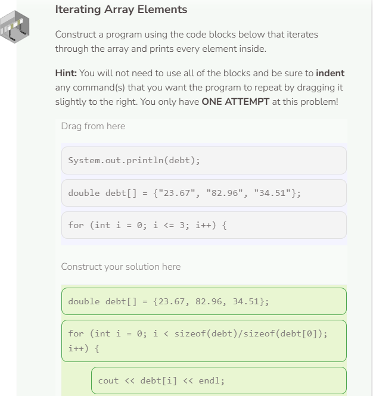
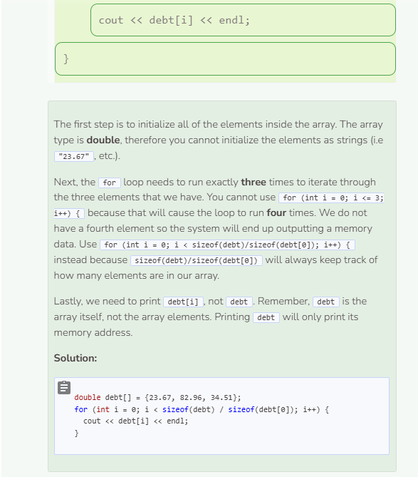

# Iterating an Array
## Array Iteration
Though we can add many elements to our array, printing each of them can get quite tedious. For example, if we have 10 names of friends in our array, we would need to specify each of their array index to print them.

```cpp
string friends[] = {"Alan", "Bob", "Carol", "David", "Ellen", 
                    "Fred", "Grace", "Henry", "Ian", "Jen"};

cout << friends[0] << endl;
cout << friends[1] << endl;
cout << friends[2] << endl;
cout << friends[3] << endl;
cout << friends[4] << endl;
cout << friends[5] << endl;
cout << friends[6] << endl;
cout << friends[7] << endl;
cout << friends[8] << endl;
cout << friends[9] << endl;
```
Luckily, we can use loops which we had learned previously to help us with this process. To print out all of our friends’ names without repeating the print statement ten times, we can use a for loop to iterate 10 times.

```cpp
string friends[] = {"Alan", "Bob", "Carol", "David", "Ellen", 
                    "Fred", "Grace", "Henry", "Ian", "Jen"};

for (int i = 0; i < 10; i++) {
  cout << friends[i] << endl;
}
```
Notice that the print statement above includes i as the index for friends. We do this because i will take on the values specified by the for loop. The loop starts at 0 and increments by 1 until it reaches 9 (not including 10). Thus, friends[0] will print, then friends[1], so on and so forth until friends[9] is printed. Then the loop ends.

## Array Size
To make the iteration process easier, we can use the `sizeof()` operator to determine how many elements are in our array. To use `sizeof()`, just call it by using the keyword sizeof followed by the array name within parentheses `()`.

```cpp
string friends[] = {"Alan", "Bob", "Carol", "David", "Ellen", 
                    "Fred", "Grace", "Henry", "Ian", "Jen"};

cout << sizeof(friends) << endl;
```
### Why Does `sizeof(friends)` output 320?
Unfortunately, the `sizeof()` operator does not determine the number of the elements within an array. Instead, `sizeof()` calculates the size of the array in bytes. In C++, a string takes up 32 bytes and since there are 10 string elements in the array, the size of the array in bytes is 320.

To calculate the number of elements within an array, we will need to use `sizeof()` twice.

```cpp
string friends[] = {"Alan", "Bob", "Carol", "David", "Ellen", 
                    "Fred", "Grace", "Henry", "Ian", "Jen"};

cout << sizeof(friends) / sizeof(friends[0]) << endl;
```
`sizeof(friends)` calculates the array’s size in bytes and `sizeof(friends[0])` calculates the first element’s size in bytes. By dividing the array size by the element’s size, we were able to determine the number of elements that exist within the array. Note that it doesn’t matter whether we calculate the first element’s size or the second’s since all of the elements are of the same size (32 bytes each).

## Looping Through the Elements
Now that you can determine number of elements within an array, you can loop through the array to output each element individually.

```cpp
string friends[] = {"Alan", "Bob", "Carol", "David", "Ellen", 
                    "Fred", "Grace", "Henry", "Ian", "Jen"};

for (int i = 0; i < sizeof(friends) / sizeof(friends[0]); i++) {
  cout << friends[i] << endl;
}
```
Notice how `sizeof(friends) / sizeof(friends[0])` continues to keep track of how many elements are in our array even though we’ve made several changes.


