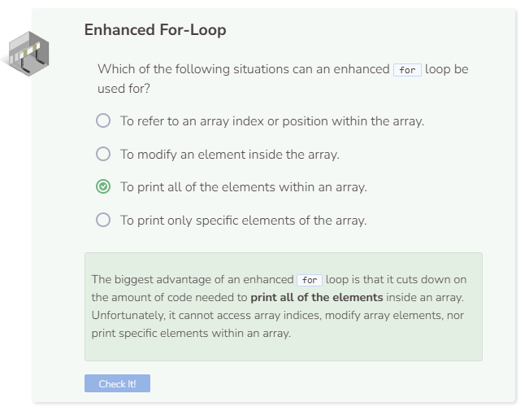

# Enhanced For Loop
## Using an Enhanced For-Loop
There is a special type of `for` loop that can be used with arrays called an enhanced `for` loop. An enhanced `for` loop, also known as a range-based for loop, can be used to iterate through array elements without having to refer to any array indices. To use an enhanced `for` loop, you need the following:
- The keyword for followed by parentheses `()`.
- A typed iterating variable followed by colon `:` followed by the array name.
  - Note that the iterating variable must be of the same type as the array.
- Any commands that repeat within curly braces `{}`.
  - Note that when using an enhanced for loop, you can print the iterating variable itself without using brackets `[]`.

One of the main differences between a regular for loop and an enhanced for loop is that an enhanced for loop does not refer to any index or position of the elements in the array. Thus, if you need to access or modify array elements, you cannot use an enhanced for loop. In addition, you cannot use an enhanced for loop to iterate through a part of the array. Think of an enhanced for loop as an all-or-nothing loop that just prints all of the array elements or nothing at all. Also note that the iterating variable type must match the array type. For example, you cannot use for (int i : friends) since friends is a string array and i is an integer variable. Use for (string i : friends) instead.

