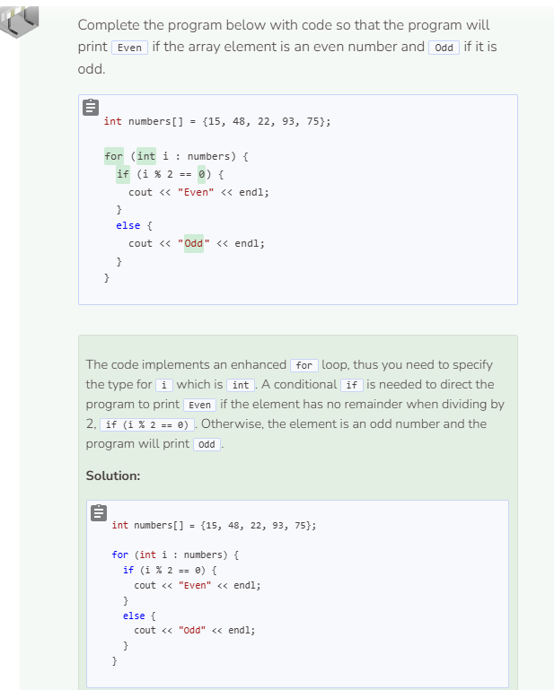

# Helpful Array Algorithms
## Array Algorithms
In addition to being used with loops, arrays can also be used with conditionals to help with tasks such as searching for a particular element, finding a minimum or maximum element, or printing elements in reverse order.

### Searching for a Particular Element
```cpp
string cars[] = {"Corolla", "Camry", "Prius", "RAV4", "Highlander"};
string Camry = "A Camry is not available."; //default string value

for (string s : cars) { //enhanced for loop
  if (s == "Camry") { //if "Camry" is in array
    Camry = "A Camry is available."; //variable changes if "Camry" exists
  }
}
    
cout << Camry << endl; //print whether Camry exists or not
```

### Finding a Minimum or Maximum Value
```cpp
int grades[] = {72, 84, 63, 55, 98};
int min = grades[0]; //set min to the first element in the array

for (int i : grades) { //enhanced for loop
  if (i < min) { //if element is less than min
    min = i; //set min to element that is less
  }
}
//elements are not modified so enhanced for loop can be used

cout << "The lowest grade is " << min << endl; //print lowest element
```

```cpp
int grades[] = {72, 84, 63, 55, 98};
int max = grades[0];

for (int i : grades) {
  if (i > max) {
    max = i;
  }
}

cout << "The highest grade is " << max << endl;
```

### Printing Elements in Reverse Order
```cpp
string letters[] = {"A", "B", "C", "D", "E"};
int elements = sizeof(letters) / sizeof(letters[0]); //number of elements

//start at index 4, then decrement by 1 until i < 0, then stop
for (int i = elements - 1; i >= 0; i--) {
  cout << letters[i] << endl;
}

//regular for loop needed to access each element index
```


