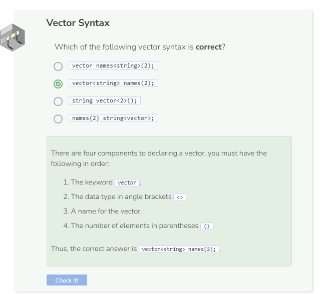

# Creating a Vector
## What Is a Vector?
Although arrays are very useful for data collection, they are considered static, meaning once they are created, you cannot add or remove elements from them without changing the way they are initialized. Vectors, on the other hand, are dynamic, meaning you can make changes to them while the program is running. Vectors are particularly helpful when you don’t know how large your collection of elements will become. Since vectors are dynamic, you can add and remove elements later on if needed. In order to use vectors, you must include `#include <vector>` in the header of your program. For convenience, the program file to your left already contains the included statement.

## Vector Creation
To create a vector, you need to include the following:
- The keyword `vector` followed by the data type in angle brackets `<>`.
- A variable name that refers to the vector.
- The number of elements the vector can hold within parentheses `()`.

```cpp
vector<int> numbers(3);

cout << numbers << endl;
```
When you try to print an array reference variable, you will get the array’s memory address. However, this is not the case for vectors.

To print an element within the vector, use the `at()` function and specify the index of the position of the element you wish to print within the parentheses.

```cpp
vector<int> numbers(3);

cout << numbers.at(0) << endl;
```
Similar to arrays, the first index or position of the vector also starts at index `0`. Thus, `numbers.at(0)` refers to the element at the first position in the vector, which currently does not contain any initialized elements. When a vector is declared without any initialized elements, the system will populate the vector with 0 as elements by default. This is common across vectors of many data types except strings. Additionally, if you try to output an element at an index that does not exist, you will get an out_of_range error message.

## Determining Vector Size
Vectors use the function `size()` to determine the number of elements that exist instead of the operator `sizeof()` which is used for arrays. Note their slight difference in syntax and usage.

In both arrays and vectors, you must specify how many elements you expect them to hold. Otherwise, you will not be able to determine their size. However, if you initialize the array or vector upon declaration, then you don’t have to specify the number of elements since the system can determine that automatically.



